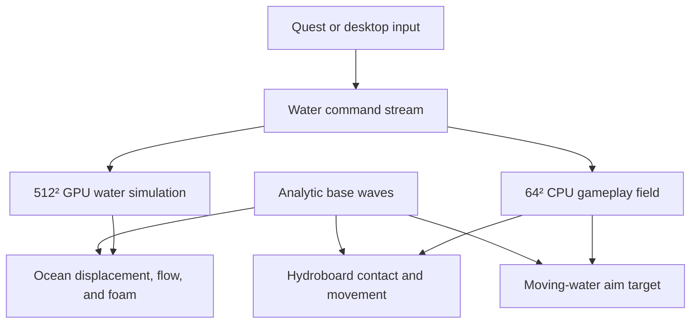

# TideVR architecture

## Data flow

The visual and gameplay simulations receive the same immutable command stream.
They do not exchange frames and board physics never waits for GPU readback.

## Water channels

Both dynamic fields use the same semantic layout:

| Channel | State | Notes |
| --- | --- | --- |
| R | Water height | Signed displacement around mean sea level |
| G | Horizontal velocity X | Signed world-space flow |
| B | Horizontal velocity Z | Signed world-space flow |
| A | Foam and turbulence | Clamped visual/gameplay intensity |

The GPU field uses two RGBA16F render targets and a fixed 30 Hz accumulator.
The initial CPU field is 64² over the same 180-meter domain. It is deliberately
coarse so five board samples are cheap. Both fields apply the same conservative
height smoothing, spell strengths, and state bounds so repeated casts remain
surfable instead of accumulating narrow spikes.

The rendered surface separates scales: broad analytic swells and smoothed
dynamic deformation move vertices, while short procedural ripples affect only
the fragment normal and fade with distance. Swell feedback samples the coarse
field for the strongest forward-moving crest instead of advancing on an
independent visual clock. Current, Vortex, and wake feedback remains a
separate bounded instanced layer.

Velocity and foam use a clamped semi-Lagrangian backtrace in both fields.
Height remains on the stable divergence/pressure update. This lets foam and
flow move through the domain without replacing the inexpensive shallow-water
model with a full fluid solver.

While water-contact is active, the hydroboard emits short wake commands along
its path. Each command cuts a shallow center trough, raises two side rails, and
adds foam. Overlapping samples form a curved trail that affects both visual and
gameplay fields, while matching instanced foam rails keep it readable under
flat lighting.

## Module boundaries

- `src/game/` owns ability metadata and command contracts. It knows nothing
  about Three.js render targets.
- `src/water/baseWaves.ts` is the CPU source of truth for analytic waves.
  `OceanMaterial.ts` generates equivalent GLSL from the same constants.
- `src/water/WaterSimulation.ts` owns GPU ping-pong state and simulation
  stepping. Every offscreen pass uses `withPreservedRenderTarget`, which
  disables WebXR camera substitution and restores the active headset target,
  cube face, mip level, and XR state even after an exception.
- `src/water/CoarseWaterField.ts` owns gameplay state, finite-difference
  stepping, and water sampling.
- `src/water/OceanSurface.tsx` fans commands into both simulations and binds
  the current GPU texture to the 180-meter near ocean. It also owns the
  analytic 900-meter far-ocean skirt and render-only quality tier.
- `src/water/WaterSpellVisualizer.tsx` renders lightweight transient signatures
  for Swell, Current, and Vortex without changing gameplay state. Swell cue
  searches are capped and updated at the gameplay field's 30 Hz cadence.
- `src/player/hydroboardPhysics.ts` owns deterministic contact-dependent
  horizontal water coupling. Airborne coupling is zero, landing coupling is
  reduced, and Current acceleration is based on relative water velocity.
- `src/player/HydroboardController.tsx` maps XR/desktop input into board forces
  and water commands. It depends only on the `WaterSampler` interface. A
  ray-marched aim helper finds the first moving-water crossing instead of
  intersecting a flat plane.
- `src/xr/store.ts` owns WebXR session entry. It requests 72 Hz when available,
  medium foveation, layers, and a deliberately small feature set. Development
  emulation is opt-in with `?emulate=1` and never replaces native XR silently.
- `src/xr/` also owns normalized input, chase-yaw, loop-transition, performance,
  and in-headset status helpers. These behaviors are unit tested outside React.

React state is used for low-frequency UI choices. Mutable simulation, input,
and physics state stays in refs or plain classes to avoid React renders on a
frame boundary.

Hydroboard telemetry is limited to roughly 10 Hz and drives procedural audio,
the desktop developer panel, and the in-headset status display. Performance
statistics come from the R3F/XR render loop rather than the browser's unrelated
window animation loop.

## Current numerical model

The initial fields use a damped shallow-water approximation:

1. Height gradients accelerate horizontal velocity.
2. Velocity divergence changes height.
3. A semi-Lagrangian backtrace transports velocity and foam.
4. Height and velocity decay prevents permanent effects.
5. Strong gradients and spell stamps add foam.

This is a foundation for feel testing, not a final ocean model. CPU and GPU
fields share command semantics and transport direction, but they do not need
texel-perfect identity.

## Domain recentering

The first build uses a fixed 180-meter domain and rebases the course under a
brief camera-following storm veil. Rider, desktop camera, and XR origin are
shifted together while velocity and heading remain continuous. Before the
endless-ocean milestone:

1. Track a snapped simulation origin near the board.
2. Shift or clear only when the rider crosses a safe inner boundary.
3. Make spell lifetimes shorter than the recenter horizon.
4. Rebase buoys and atmosphere separately from simulation coordinates.

Because all local effects dissipate, clearing newly exposed cells is expected
and does not destroy permanent player-authored terrain.

## Quest performance budget

- 512² dynamic GPU field at 30 Hz, not every display frame.
- 64² CPU field at 30 Hz.
- A 180 m simulated near patch plus a 900 m analytic far-ocean skirt.
- Render-only water tiers leave both simulation fields unchanged:
  `low` = 96 near segments / 12 m far spacing, `medium` = 144 / 8 m,
  and `high` = 192 / 6 m. `medium` is the default.
- Device pixel ratio capped at 1.25.
- Native XR foveation requested while presenting.
- No GPU readback, reflection pass, transparent ocean, or post-processing.
- Particle work must remain batched and quality-scaled when added.
- Offscreen water passes must always retain their orthographic camera while XR
  is presenting.
