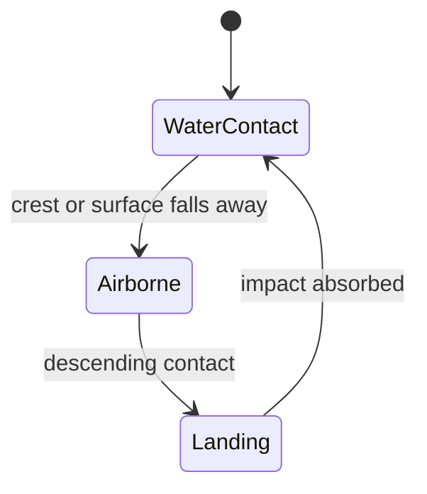

# TideVR gameplay brief

## Core fantasy

The player rides a magical hydroboard across an open ocean. The board leaves a
wake while the left controller handles movement and carving and the right
controller shapes the water ahead.

Water deformation is movement:

- Waves launch the rider or become surfable slopes.
- Currents accelerate and redirect the board.
- Vortices pull the rider into tight turns and slingshots.

Unlike SnowVR's persistent terrain, TideVR effects propagate, interact, and
dissipate.

## Abilities

| Ability | Casting rhythm | Water result | Movement result |
| --- | --- | --- | --- |
| Swell | Hold to charge, release | Traveling wave packet | Surf, climb, and jump |
| Current | Hold and paint | Directional flow ribbon | Accelerate and redirect |
| Vortex | Aim and tap | Rotating depression | Pull, turn, and slingshot |

### Swell

A larger charge creates a stronger wave that travels farther and costs more
energy. Approaching from behind should add speed, crossing the crest should
launch the board, and hitting the face from the wrong direction should remove
momentum. It propagates and flattens rather than becoming terrain.

### Current

The aimed controller direction establishes flow direction while the trigger
paints. The board and floating objects are accelerated with the flow; fighting
it adds drag. Foam bands and directional micro-ripples keep the flow readable.

### Vortex

A tap creates a temporary depression with tangential and inward velocity. Force
falls off smoothly with distance. The outer bank supports sharp turns and a
well-timed exit creates a slingshot; the center is dangerous without requiring
underwater play.

## Combination language

- Swell plus Current produces a faster surfable wave.
- A Current beside a Vortex bends into a curved route.
- A Vortex behind the board can pull and release a slingshot.
- A Vortex beside a Swell bends the wave packet.
- Opposing Currents create a turbulent scoring zone.
- A Swell passing through a Vortex can become a spiral crest.

The simulation, not special-case combo buttons, should create these results.

## Board contact model

The board samples the water at its center, front, back, left, and right. These
samples supply:

- Surface height and normal.
- Pitch and roll.
- Local current velocity.
- Crest and launch conditions.
- Airborne clearance and landing impact.

The contact state machine is:

The board is influenced by rider velocity, current velocity, and the
down-gradient pull of gravity. It is never rigidly attached to the surface.

## Storm Run vertical slice

The first scored mode is a three-minute course:

- Pass floating gates and reach the beacon.
- Ride crests to build hydromancy.
- Paint Currents to preserve speed.
- Use Swells to clear barriers.
- Use Vortices for tight turns.
- Collect stranded energy buoys.

Clean lines and landings recharge energy. Missed gates, crashes, and fighting
Currents drain momentum. Buoys, debris, ships, foam bands, and storm fronts
provide outdoor scale.

## Visual constraints

Prioritize broad procedural waves, local spell waves, Fresnel, crest foam,
wakes, sun glints, spray, mist, rain, and a simple horizon. Defer
screen-space reflections, planar reflections, transparent refraction,
underwater caustics, and reflected scenery.
